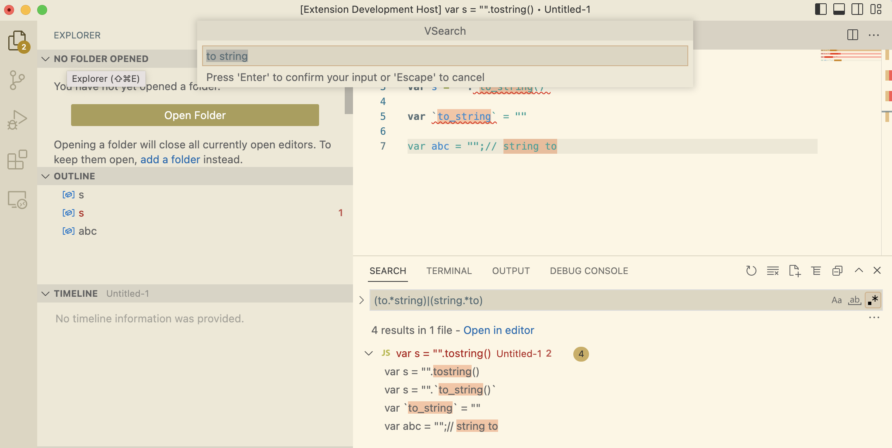

# vsearch README

fuzzy search by words

## Features

1. Generate a regex expression by inputs,for example `to string` -> `(to.*string)|(string.*to)`
2. Search with the regex experssion

## Keyboard ShortCut
Shift + F1

vsearch.searchCmd (via Ctrl + Shift + P)

## demo

**Enjoy!**
